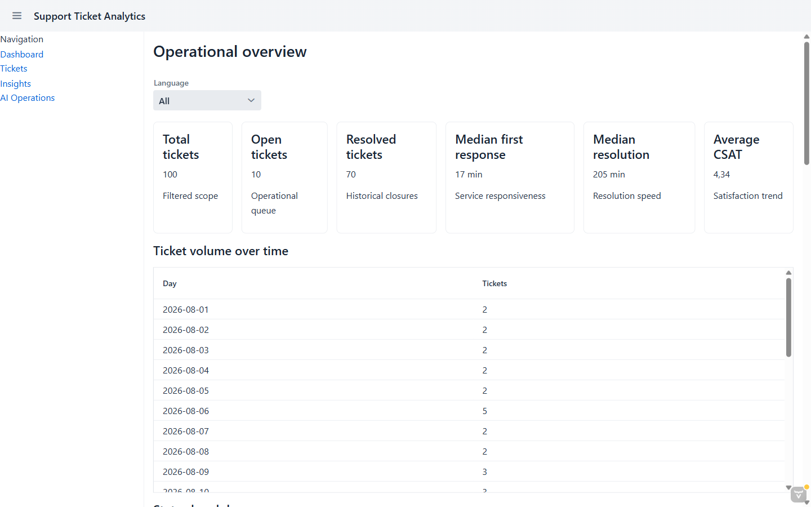
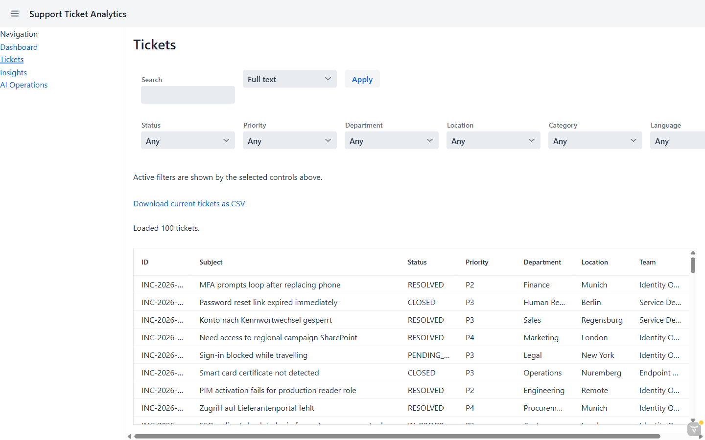
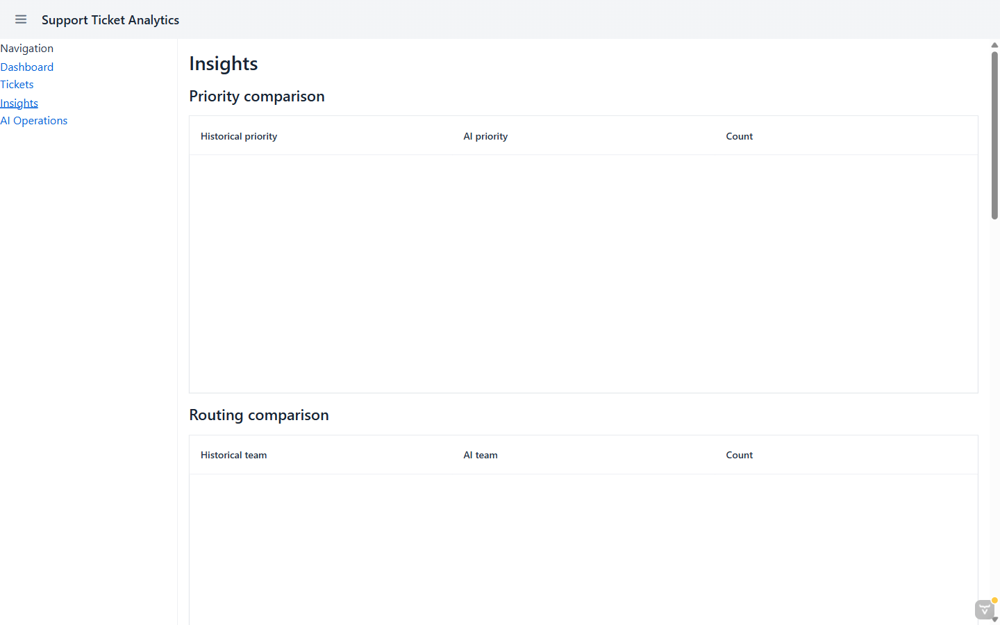
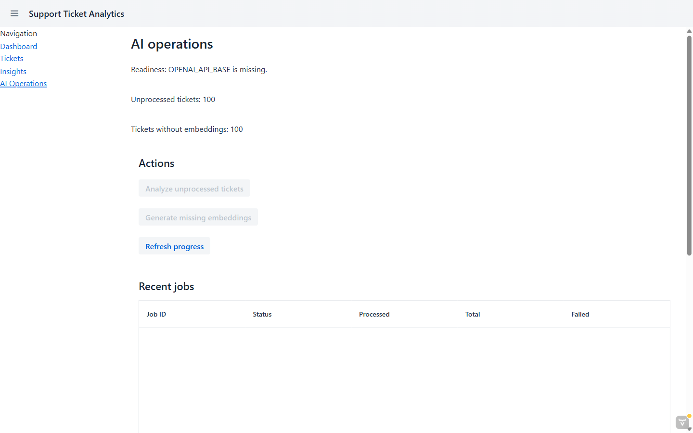

# java-azure-ai

This repository accompanies the live-coding session recorded at
[https://youtube.com/live/TI7_Wz5Oag0](https://youtube.com/live/TI7_Wz5Oag0).

Code and progress shown during the stream will be committed here as the session unfolds.

The actual application built during the session lives at
[bbenz/20260827-jug-oberpfalz-demo](https://github.com/bbenz/20260827-jug-oberpfalz-demo).

## Screenshots

Support Ticket Analytics dashboard, running locally at `http://localhost:8080/`:

### Dashboard

### Tickets

### Insights

### AI Operations

